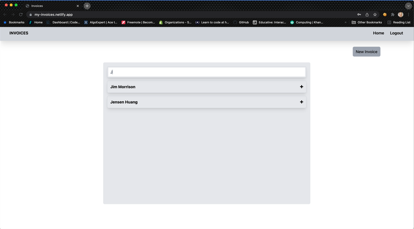
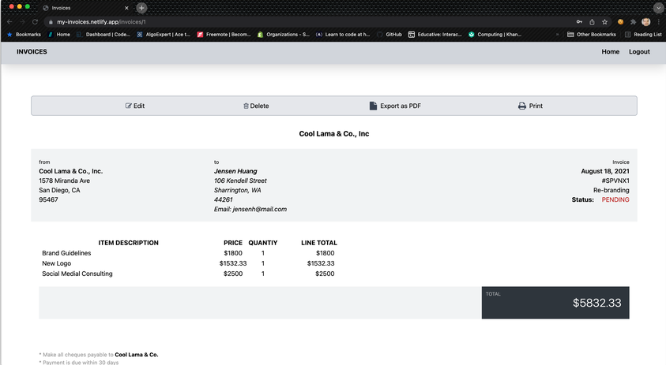
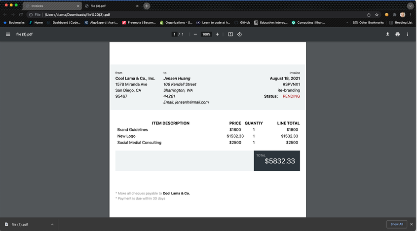

# Invoices
This application creates and manages Invoices for an account.
## General Information
- Create, update and delete invoices.
- Easily create and manage invices for your Clients, download the invoice as pdf onto your computer, or direct it to the printer.
- User is able to filter invoices by Client name or desciption of invoice.

This is the front end. Here is the link to the back end https://github.com/iamme24cl/invoices-backend

Demo Video hosted [_here_](https://www.loom.com/share/4c4f5df831e14e61827c769807e2b9e4?sharedAppSource=personal_library).

## ScreenShots :sunny:
##### Login Page

--
##### Home Page

--
##### Filter Invoices

--
##### Filter Invoices

--
##### Invoice Form with dynamically generated and removed form fields for items

--
##### Invoice Page

--
##### Download as PDF

--
##### Print Page

--

## Table of Contents
* [General Info](#general-information)
* [Technologies Used](#technologies-used)
* [Usage](#usage)
* [Contact](#contact)

## Technologies Used
### Frontend
* React
* Redux
* BootStrap
### Backend 
* Ruby on Rails
* PostgreSQL

## Usage
* Clone this backend repository to your machine  https://github.com/iamme24cl/invoices-backend
* Run `bundle` to install all gems listed in the gemfile
* Run `rails db:create && db:migrate` to create and migrate the database (If you are on a windows machine, you will need to make sure your PostgreSQL server is running. You can easily manage this in the PGAdmin desktop application.)
* Run `rails s` to run the server
* On Your front-end folder run `npm install && npm start` to install all dependecies listed in the package.json file and start the server and run the application in the browser.

## Contact
Created by [@iamme24cl](https://github.com/iamme24cl) - feel free to contact me!

